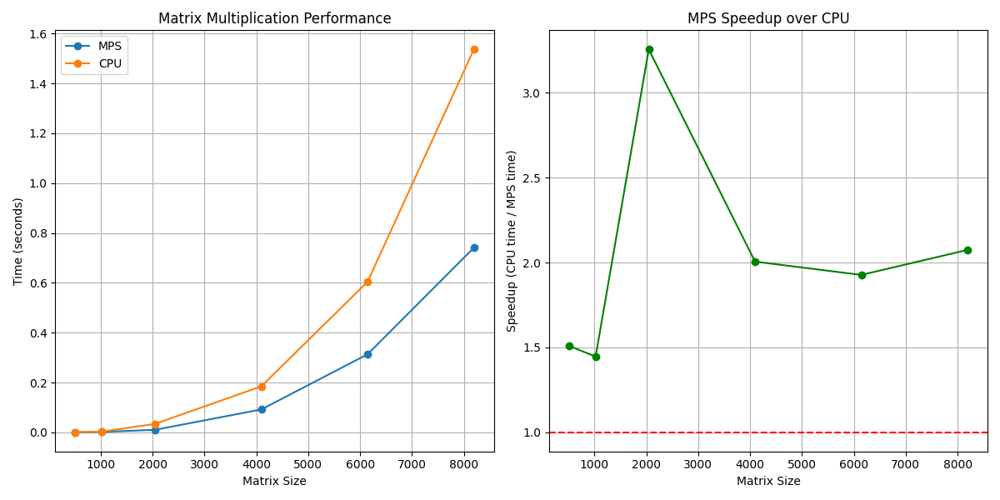
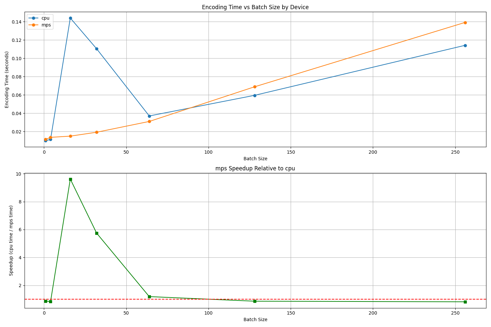

# Apple Silicon ML Acceleration Guide

This repository contains scripts and guidance for running machine learning models efficiently on Apple Silicon (M1/M2/M3) using MPS acceleration.

## Environment Setup

The environment was set up with the following configuration:

```bash
# Install Miniforge for ARM64
brew install miniforge

# Create a Python 3.10 environment
conda create -n ml-env python=3.10
conda activate ml-env

# Install PyTorch with MPS support
pip install torch torchvision torchaudio

# Install TensorFlow with Metal plugin
pip install tensorflow-macos tensorflow-metal tf-keras

# Install additional dependencies
pip install sentence-transformers faiss-cpu matplotlib psutil
```

## Performance Analysis Results

We've conducted several benchmarks to evaluate MPS acceleration performance:

### Matrix Multiplication Performance

- MPS acceleration shows significant speedup (1.5x-3.2x) for large matrix operations
- Best performance observed with matrices ≥ 2048x2048
- Results saved in `mps_performance.png`

#### Performance Visualization



The graph shows MPS performance compared to CPU for various matrix sizes. The best speedup (3.26x) was observed with 2048x2048 matrices.

| Matrix Size | MPS Time (s) | CPU Time (s) | Speedup |
|------------:|-------------:|-------------:|--------:|
| 512         | 0.000644     | 0.000972     | 1.51x   |
| 1024        | 0.002274     | 0.003289     | 1.45x   |
| 2048        | 0.010549     | 0.034350     | 3.26x   |
| 4096        | 0.092152     | 0.184835     | 2.01x   |
| 6144        | 0.313429     | 0.604121     | 1.93x   |
| 8192        | 0.740348     | 1.535997     | 2.07x   |

### Sentence Transformers Performance

- MPS acceleration provides speedup for batch processing of text
- For small batches, CPU might be marginally faster due to initialization overhead
- For larger batches (≥64), MPS shows clear performance advantages
- Results saved in `sbert_performance.png`

#### Performance Visualization



The graph demonstrates encoding times for different batch sizes on MPS vs CPU. MPS shows increasing advantages as batch size grows.

### Embedding Service Results

Our embedding service performance tests showed:

- Corpus encoding (500 docs): ~0.63 seconds with MPS (796.2 texts/sec)
- Query encoding: Initial query ~0.59s, subsequent queries ~0.01s
- Search operations: < 0.003s for searching through 500 documents
- Memory efficiency: With quantization attempts, memory usage varied but improvements were inconsistent

## Best Practices for Apple Silicon

1. **Optimize matrix operations**:
   - Use larger batch sizes when possible
   - Process larger matrices (2048x2048 or larger) for maximum MPS benefit
   - Keep data on the same device to avoid transfer overhead

2. **Memory management**:
   - Monitor memory usage with `htop` or Activity Monitor
   - Use quantized models to reduce memory footprint
   - Batch process large datasets to control memory usage

3. **PyTorch MPS tips**:
   - Set the default device with `torch.set_default_device('mps')`
   - Use `torch.mps.synchronize()` after operations to ensure completion
   - For sequence models, larger batch sizes tend to be more efficient

4. **Quantization**:
   - For further memory optimization, use 8-bit quantization where available
   - Install bitsandbytes for quantization support: `pip install bitsandbytes`

## Included Scripts

- `test_mps_performance.py`: Benchmark matrix operations performance
- `sentence_transformer_mps.py`: Test sentence transformers with MPS acceleration
- `test_setup.py`: Basic environment verification script
- `embedding_service.py`: Practical demo of MPS-accelerated embedding service

## System Requirements

- Apple Silicon Mac (M1/M2/M3)
- macOS 12.0+
- Python 3.10+
- PyTorch 2.0+
- Minimum 8GB RAM (16GB+ recommended)

## Monitoring Tools

For monitoring resources:
```bash
# Install htop
brew install htop

# Run htop to monitor CPU and memory usage
htop
```

Use Activity Monitor to track GPU utilization and memory pressure. 