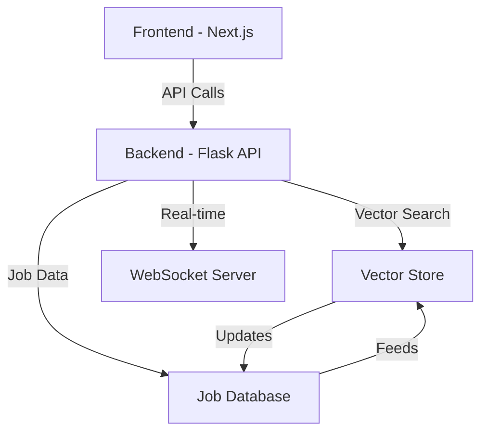

# Job Search Platform - Complete Setup Guide

## System Overview

### Architecture


## 1. Backend Setup

### 1.1 Environment Setup
```bash
# Create Python virtual environment
python -m venv env

# Activate virtual environment
# On Unix/macOS:
source env/bin/activate
# On Windows:
.\env\Scripts\activate

# Install dependencies
pip install -r Scraping/requirements.txt
```

### 1.2 Required Dependencies
```python
# requirements.txt
flask==2.0.1
flask-cors==3.0.10
numpy==1.21.2
pandas==1.3.3
faiss-cpu==1.7.2
sentence-transformers==2.2.0
python-dotenv==0.19.0
bson==0.5.10
opencv-python==4.5.3.56
nltk==3.6.3
```

### 1.3 Backend Configuration
```python
# .env file in Scraping directory
FLASK_APP=api.py
FLASK_ENV=development
API_PORT=8080
API_HOST=0.0.0.0
VECTOR_STORE_DIR=vector_store
DATA_DIR=adzuna_data
```

### 1.4 Initialize Vector Store
```bash
cd Scraping
python update_vector_store.py
```

### 1.5 Start Backend Server
```bash
# Development mode
python api.py --port 8080 --host 0.0.0.0 --debug

# Production mode
python api.py --port 8080 --host 0.0.0.0
```

## 2. Frontend Setup

### 2.1 Environment Setup
```bash
# Install Node.js dependencies
cd ui
npm install
```

### 2.2 Frontend Configuration
```typescript
// ui/.env.local
NEXT_PUBLIC_API_URL=http://localhost:8080
NEXT_PUBLIC_WS_URL=ws://localhost:8080
```

### 2.3 API Configuration
```typescript
// ui/src/config/api.ts
export const API_CONFIG = {
  BASE_URL: process.env.NEXT_PUBLIC_API_URL || 'http://localhost:8080',
  WS_URL: process.env.NEXT_PUBLIC_WS_URL || 'ws://localhost:8080',
  ENDPOINTS: {
    JOBS: '/api/jobs',
    RESUME: '/api/resume',
    INTERVIEW: '/api/interview',
    USER: '/api/user',
    ANALYTICS: '/api/analytics',
    SALARY: '/api/salary',
    HEALTH: '/api/health'
  }
};
```

### 2.4 Start Frontend Server
```bash
cd ui
npm run dev
```

## 3. API Integration

### 3.1 API Service Setup
```typescript
// ui/src/services/api.ts
import { API_CONFIG } from '../config/api';

export class APIService {
  private static instance: APIService;
  private baseURL: string;

  private constructor() {
    this.baseURL = API_CONFIG.BASE_URL;
  }

  static getInstance(): APIService {
    if (!APIService.instance) {
      APIService.instance = new APIService();
    }
    return APIService.instance;
  }

  // Job Search
  async searchJobs(params: JobSearchParams): Promise<JobSearchResponse> {
    const queryString = new URLSearchParams(params).toString();
    return this.get(`${API_CONFIG.ENDPOINTS.JOBS}/search?${queryString}`);
  }

  // Resume Matching
  async matchResume(file: File): Promise<ResumeMatchResponse> {
    const base64 = await this.fileToBase64(file);
    return this.post(`${API_CONFIG.ENDPOINTS.RESUME}/match`, {
      resume: base64,
      file_type: file.type
    });
  }

  // Generic request methods
  private async get(endpoint: string) {
    const response = await fetch(`${this.baseURL}${endpoint}`, {
      headers: this.getHeaders()
    });
    return this.handleResponse(response);
  }

  private async post(endpoint: string, data: any) {
    const response = await fetch(`${this.baseURL}${endpoint}`, {
      method: 'POST',
      headers: this.getHeaders(),
      body: JSON.stringify(data)
    });
    return this.handleResponse(response);
  }

  private getHeaders() {
    return {
      'Content-Type': 'application/json',
      'Authorization': `Bearer ${this.getToken()}`
    };
  }

  private async handleResponse(response: Response) {
    if (!response.ok) {
      const error = await response.json();
      throw new APIError(error);
    }
    return response.json();
  }

  private getToken(): string {
    // Implement token retrieval logic
    return localStorage.getItem('token') || '';
  }

  private async fileToBase64(file: File): Promise<string> {
    return new Promise((resolve, reject) => {
      const reader = new FileReader();
      reader.readAsDataURL(file);
      reader.onload = () => resolve(reader.result as string);
      reader.onerror = error => reject(error);
    });
  }
}
```

### 3.2 WebSocket Integration
```typescript
// ui/src/services/websocket.ts
import { API_CONFIG } from '../config/api';

export class WebSocketService {
  private socket: WebSocket;
  private static instance: WebSocketService;
  private messageHandlers: Map<string, Function[]>;

  private constructor() {
    this.socket = new WebSocket(API_CONFIG.WS_URL);
    this.messageHandlers = new Map();
    this.setupEventHandlers();
  }

  static getInstance(): WebSocketService {
    if (!WebSocketService.instance) {
      WebSocketService.instance = new WebSocketService();
    }
    return WebSocketService.instance;
  }

  private setupEventHandlers() {
    this.socket.onmessage = (event) => {
      const data = JSON.parse(event.data);
      this.handleMessage(data);
    };

    this.socket.onclose = () => {
      setTimeout(() => this.reconnect(), 5000);
    };
  }

  private handleMessage(data: any) {
    const handlers = this.messageHandlers.get(data.type) || [];
    handlers.forEach(handler => handler(data));
  }

  subscribe(eventType: string, handler: Function) {
    const handlers = this.messageHandlers.get(eventType) || [];
    handlers.push(handler);
    this.messageHandlers.set(eventType, handlers);
  }

  unsubscribe(eventType: string, handler: Function) {
    const handlers = this.messageHandlers.get(eventType) || [];
    const index = handlers.indexOf(handler);
    if (index !== -1) {
      handlers.splice(index, 1);
      this.messageHandlers.set(eventType, handlers);
    }
  }

  private reconnect() {
    this.socket = new WebSocket(API_CONFIG.WS_URL);
    this.setupEventHandlers();
  }
}
```

### 3.3 Usage in Components
```typescript
// ui/src/components/JobSearch.tsx
import { APIService } from '../services/api';
import { useState } from 'react';

export const JobSearch: React.FC = () => {
  const api = APIService.getInstance();
  const [jobs, setJobs] = useState<Job[]>([]);
  const [loading, setLoading] = useState(false);

  const handleSearch = async (params: JobSearchParams) => {
    try {
      setLoading(true);
      const response = await api.searchJobs(params);
      setJobs(response.jobs);
    } catch (error) {
      console.error('Search failed:', error);
    } finally {
      setLoading(false);
    }
  };

  return (
    // Component JSX
  );
};
```

## 4. Development Workflow

### 4.1 Running the Full Stack
```bash
# Terminal 1 - Backend
cd Scraping
source env/bin/activate
python api.py --debug

# Terminal 2 - Frontend
cd ui
npm run dev
```

### 4.2 Testing API Endpoints
```bash
# Health check
curl http://localhost:8080/api/health

# Search jobs
curl "http://localhost:8080/api/jobs/search?query=python&limit=10"
```

### 4.3 Debugging
1. Backend Logs: Check `Scraping/logs/` directory
2. Frontend Logs: Browser console
3. API Issues: Use the `/debug` endpoint
4. Vector Store: Run `python rebuild_vector_store.py`

## 5. Production Deployment

### 5.1 Backend Deployment
```bash
# Install production dependencies
pip install gunicorn

# Start with Gunicorn
gunicorn --bind 0.0.0.0:8080 --workers 4 api:app
```

### 5.2 Frontend Deployment
```bash
# Build frontend
cd ui
npm run build

# Start production server
npm start
```

### 5.3 Environment Variables
```bash
# Backend (.env.production)
FLASK_ENV=production
API_HOST=0.0.0.0
API_PORT=8080
CORS_ORIGINS=https://your-domain.com

# Frontend (.env.production)
NEXT_PUBLIC_API_URL=https://api.your-domain.com
NEXT_PUBLIC_WS_URL=wss://api.your-domain.com
```

## 6. Monitoring and Maintenance

### 6.1 Health Checks
```typescript
const monitorHealth = async () => {
  const health = await checkAPIHealth();
  if (!health.api || !health.vector_store) {
    notifyAdmins('System health degraded');
  }
};
```

### 6.2 Error Monitoring
```typescript
window.onerror = (message, source, lineno, colno, error) => {
  // Send to monitoring service
  console.error('Global error:', { message, source, lineno, colno, error });
};
```

### 6.3 Updating Job Data
```bash
# Update job database
cd Scraping
./run_job_scraper.sh

# Rebuild vector store
python update_vector_store.py
```

## 7. Security Considerations

1. **API Security**
   - Use HTTPS in production
   - Implement rate limiting
   - Validate all inputs
   - Use secure headers

2. **Authentication**
   - Implement JWT tokens
   - Secure token storage
   - Regular token rotation

3. **Data Protection**
   - Sanitize user inputs
   - Encrypt sensitive data
   - Regular security audits

## 8. Troubleshooting

### Common Issues and Solutions

1. **API Connection Failed**
   - Check if backend server is running
   - Verify correct API URL in frontend config
   - Check CORS settings

2. **Vector Store Issues**
   - Run `rebuild_vector_store.py`
   - Check disk space
   - Verify data files exist

3. **WebSocket Connection Failed**
   - Check WebSocket URL configuration
   - Verify server supports WebSocket
   - Check firewall settings 